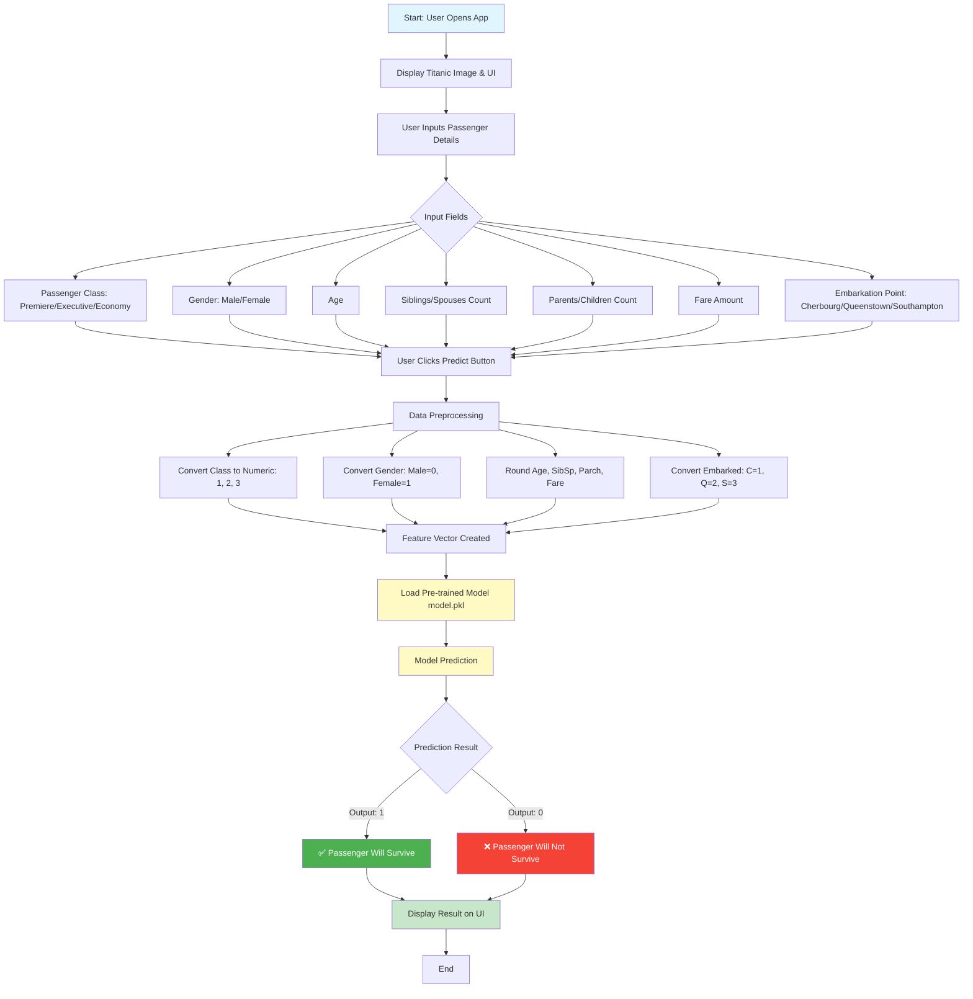

# Titanic Survival Prediction

A machine learning-powered web application that predicts passenger survival on the Titanic using historical data. Built with Streamlit and scikit-learn, this application provides real-time predictions based on passenger attributes.

## Live Demo

**Deployed Application:** https://who-survived-the-titanic-sks-zv25mkz8y.streamlit.app/

Try it now! Enter passenger details and get instant survival predictions.

---

## Application Architecture & Flow



---

## Key Features

- **Interactive User Interface**: Clean, organized input fields for all passenger attributes
- **Real-time Predictions**: Instant survival predictions based on machine learning model
- **Historical Context**: Displays RMS Titanic image for visual context
- **Data Preprocessing**: Automatic encoding and conversion of categorical variables
- **Responsive Design**: Multi-column layout optimized for different screen sizes
- **Trained Model**: Logistic Regression model trained on 891 passenger records

---

## Tech Stack

| Technology | Purpose |
|------------|---------|
| **Python 3.x** | Core programming language |
| **Streamlit** | Web application framework |
| **Pandas** | Data manipulation and analysis |
| **Scikit-learn** | Machine learning model training |
| **Seaborn** | Data visualization (for model training) |
| **Pickle** | Model serialization |

---

## Project Structure

```
titanic-survival-prediction/
│
├── main.py                      # Main Streamlit application
├── model.pkl                    # Pre-trained ML model (serialized)
├── titanic dataset.ipynb        # Jupyter notebook for model training
├── requirements.txt             # Python dependencies
├── .gitignore                   # Git ignore file
└── README.md                    # Project documentation (this file)
```

---

## Installation & Setup

### Prerequisites

- Python 3.7 or higher
- pip (Python package manager)

### Step 1: Clone the Repository

```bash
git clone <your-repository-url>
cd titanic-survival-prediction
```

### Step 2: Create Virtual Environment (Recommended)

```bash
# Windows
python -m venv venv
venv\Scripts\activate

# macOS/Linux
python3 -m venv venv
source venv/bin/activate
```

### Step 3: Install Dependencies

```bash
pip install -r requirements.txt
```

### Step 4: Run the Application

```bash
streamlit run main.py
```

The app will automatically open in your default browser at `http://localhost:8501`

### Quick Start (One Command)

If you have all dependencies installed, simply run:

```bash
streamlit run main.py
```

### Troubleshooting

**Issue: "ModuleNotFoundError: No module named 'streamlit'"**
```bash
pip install -r requirements.txt
```

**Issue: "FileNotFoundError: model.pkl"**
- Ensure `model.pkl` is in the same directory as `main.py`
- The model file should be present after cloning the repository

**Issue: Port 8501 already in use**
```bash
streamlit run main.py --server.port 8502
```

---

## Usage Guide

### Input Parameters

1. **Passenger Class**
   - Premiere (1st Class)
   - Executive (2nd Class)
   - Economy (3rd Class)

2. **Gender**
   - Male
   - Female

3. **Age**
   - Enter passenger's age (numeric value)

4. **Siblings/Spouses (SibSp)**
   - Number of siblings or spouses aboard

5. **Parents/Children (Parch)**
   - Number of parents or children aboard

6. **Fare**
   - Journey fare amount

7. **Embarkation Point**
   - Cherbourg (France)
   - Queenstown (Ireland)
   - Southampton (England)

### Getting Predictions

1. Fill in all the passenger details in the input fields
2. Click the **"Predict"** button
3. View the prediction result displayed below

### Feature Encoding in Application

The application automatically converts your inputs to the format expected by the trained model:

| User Input | Internal Encoding | Notes |
|------------|-------------------|-------|
| Premiere | 1 | First class |
| Executive | 2 | Second class |
| Economy | 3 | Third class |
| Male | 0 | Numeric encoding |
| Female | 1 | Numeric encoding |
| Cherbourg | 1 | Embarkation port |
| Queenstown | 2 | Embarkation port |
| Southampton | 3 | Embarkation port |

---

## Model Information

### Features Used

The model uses the following 7 features for prediction:

| Feature | Description | Encoding |
|---------|-------------|----------|
| Pclass | Passenger class | 1 = Premiere, 2 = Executive, 3 = Economy |
| Sex | Gender | 0 = Male, 1 = Female |
| Age | Age in years | Numeric (rounded) |
| SibSp | # of siblings/spouses | Numeric (rounded) |
| Parch | # of parents/children | Numeric (rounded) |
| Fare | Ticket fare | Numeric (rounded) |
| Embarked | Port of embarkation | 1 = C, 2 = Q, 3 = S |

### Model Training

The model was trained using the historical Titanic dataset containing passenger information and survival outcomes. The training process is documented in `titanic dataset.ipynb`.

### Prediction Output

- **1** → Passenger predicted to **SURVIVE**
- **0** → Passenger predicted to **NOT SURVIVE**

### Data Preprocessing Pipeline

The model training process included the following data preprocessing steps:

1. **Missing Value Handling**
   - Age: Filled with mean value (29.70 years)
   - Embarked: Filled with mode value (Southampton - 'S')
   - Cabin: Dropped due to 77% missing data

2. **Categorical Encoding**
   - Gender: Male = 0, Female = 1
   - Embarked: S = 0, C = 1, Q = 2
   - Pclass: Already numeric (1, 2, 3)

3. **Feature Selection**
   - Used 7 features for prediction
   - Removed non-predictive features (Name, Ticket, PassengerId)

4. **Data Split**
   - Training set: 668 samples (75%)
   - Testing set: 223 samples (25%)
   - Random seed: 42 (for reproducibility)

---

## Historical Data Insights

Based on the Titanic dataset:

- **Gender**: Women had a significantly higher survival rate (~74%) compared to men (~19%)
- **Class**: First-class passengers had better survival rates than third-class
- **Age**: Children had higher survival rates than adults
- **Family Size**: Passengers with 1-3 family members had better survival rates

---

## Application Screenshots

### Application Interface


*The application displays the historic RMS Titanic image and organized input fields for prediction.*

---

## Deployment Guide

### Deploy to Streamlit Cloud

1. Push your code to GitHub
2. Go to [Streamlit Cloud](https://streamlit.io/cloud)
3. Sign in with GitHub
4. Click "New app"
5. Select your repository, branch, and `main.py`
6. Click "Deploy"

### Alternative Deployment Options

- **Heroku**: Use `setup.sh` and `Procfile` for Heroku deployment
- **AWS EC2**: Deploy on an EC2 instance with public IP
- **Google Cloud Run**: Containerize and deploy on GCP
- **Azure Web Apps**: Deploy using Azure App Service

---

## Development & Customization

### Modifying the Model

To retrain or modify the model:

1. Open `titanic dataset.ipynb` in Jupyter Notebook
2. Make your changes to the training pipeline
3. Save the new model as `model.pkl`
4. Test the application with the updated model

### Adding New Features

To add new input features:

1. Update the UI in `main.py` to collect the new feature
2. Modify the feature vector passed to `model.predict()`
3. Retrain the model with the additional feature
4. Update this README with the new feature information

### Testing Predictions Locally

You can test the model directly with Python:

```python
import pickle
import math

# Load the model
with open("model.pkl", 'rb') as f:
    model = pickle.load(f)

# Example prediction
# Format: [Pclass, Sex, Age, SibSp, Parch, Fare, Embarked]
test_passenger = [[1, 1, 38, 1, 0, 71.28, 1]]
prediction = model.predict(test_passenger)
result = "Survive" if prediction[0] == 1 else "Not Survive"
print(f"Prediction: {result}")
```

Expected output for this example: `Prediction: Survive`

---

## Contributing

Contributions are welcome! Here's how you can help:

1. Fork the repository
2. Create a feature branch (`git checkout -b feature/AmazingFeature`)
3. Commit your changes (`git commit -m 'Add some AmazingFeature'`)
4. Push to the branch (`git push origin feature/AmazingFeature`)
5. Open a Pull Request

### Contribution Ideas

- Add data visualization charts
- Implement model comparison (multiple algorithms)
- Add feature importance visualization
- Include confidence scores in predictions
- Create unit tests
- Add more detailed error handling
- Implement user authentication
- Add prediction history tracking

---

## Model Performance Metrics

The Logistic Regression model was trained on 668 samples and tested on 223 samples from the Titanic dataset.

| Metric | Value |
|--------|-------|
| **Training Accuracy** | 79.79% |
| **Testing Accuracy** | 79.82% |
| **Training Samples** | 668 |
| **Testing Samples** | 223 |
| **Total Dataset Size** | 891 passengers |
| **Model Type** | Logistic Regression |

The model shows consistent performance between training and testing data, indicating good generalization without overfitting.

---

## Known Issues & Troubleshooting

### Common Issues

1. **ConvergenceWarning during model training**
   - This is normal and doesn't affect predictions
   - Model was trained successfully despite the warning

2. **Slight variations in predictions**
   - Rounding of decimal inputs may cause slight variations
   - This is expected behavior

3. **Port conflicts**
   - Use different port if 8501 is occupied
   - See Quick Start section for solution

### Reporting Issues

Found a bug or have suggestions? Please:
- Check existing issues on GitHub
- Provide detailed description of the problem
- Include steps to reproduce the issue
- Share Python version and OS information

---

## Resources & References

- [Titanic Dataset on Kaggle](https://www.kaggle.com/c/titanic)
- [Streamlit Documentation](https://docs.streamlit.io/)
- [Scikit-learn Documentation](https://scikit-learn.org/stable/)
- [RMS Titanic Historical Information](https://en.wikipedia.org/wiki/Titanic)

---

## License

This project is licensed under the MIT License - see the LICENSE file for details.

---

## Author & Contact

Created as a machine learning project demonstrating:
- Data preprocessing and feature engineering
- Logistic Regression model training
- Streamlit web application development
- Model deployment and serving

For questions or collaboration:
- GitHub: [@sinha-19](https://github.com/sinha-19)
- LinkedIn: [Saket Kumar Sinha](https://linkedin.com/in/saketkumarsinha19)
- Email: imsaket123@gmail.com

---

## Acknowledgments

- Kaggle for providing the Titanic dataset
- Streamlit team for the amazing framework
- The data science community for inspiration and support

---

## Frequently Asked Questions

**Q: Can I use this model for real survival predictions?**
A: This is an educational model based on historical data. Use it for learning purposes only. Real survival analysis requires much more complex models and expert analysis.

**Q: Why is the model accuracy around 80%?**
A: This is typical for Logistic Regression on the Titanic dataset. The model captures main patterns but can't predict every edge case. More complex models might achieve higher accuracy.

**Q: How often should I retrain the model?**
A: For this historical dataset, the model doesn't need retraining. If using with new data, retrain whenever patterns change significantly.

**Q: Can I modify the features used in the model?**
A: Yes! Edit the Jupyter notebook, retrain the model, and save the new model.pkl. Then update main.py to match the new feature count and encoding.

**Q: Why do I get different predictions with slightly different inputs?**
A: The model rounds inputs and makes probabilistic decisions. Small changes in input can cross the decision boundary, causing different predictions.

**Q: Is the model biased?**
A: Yes, like all historical data models, it reflects patterns from 1912. Gender-based patterns are particularly strong, reflecting historical social inequalities.

**Q: Can I use this in production?**
A: Not for real predictions. This is an educational project. For production, you'd need proper validation, documentation, and governance frameworks.

---

## Future Enhancements

- [ ] Add model explainability (SHAP values)
- [ ] Implement A/B testing with multiple models
- [ ] Add data export functionality
- [ ] Create REST API endpoint
- [ ] Add multilingual support
- [ ] Implement dark mode
- [ ] Add passenger data statistics dashboard
- [ ] Create mobile-responsive design improvements

<div align="center">

**If you found this project helpful, please give it a star!**

Made with Python and Data Science

</div>
