# 🚢 Titanic Survival Prediction App

A machine learning-powered web application that predicts passenger survival on the Titanic based on various passenger attributes. Built with Streamlit and scikit-learn.

## 🔗 Live Demo

**Deployed Application:** [Add your deployment link here]

---

## 📊 Application Flow

```mermaid
flowchart TD
    A[Start: User Opens App] --> B[Display Titanic Image & UI]
    B --> C[User Inputs Passenger Details]
    C --> D{Input Fields}
    D --> E[Passenger Class: Premiere/Executive/Economy]
    D --> F[Gender: Male/Female]
    D --> G[Age]
    D --> H[Siblings/Spouses Count]
    D --> I[Parents/Children Count]
    D --> J[Fare Amount]
    D --> K[Embarkation Point: Cherbourg/Queenstown/Southampton]

    E --> L[User Clicks Predict Button]
    F --> L
    G --> L
    H --> L
    I --> L
    J --> L
    K --> L

    L --> M[Data Preprocessing]
    M --> N[Convert Class to Numeric: 1, 2, 3]
    M --> O[Convert Gender: Male=0, Female=1]
    M --> P[Round Age, SibSp, Parch, Fare]
    M --> Q[Convert Embarked: C=1, Q=2, S=3]

    N --> R[Feature Vector Created]
    O --> R
    P --> R
    Q --> R

    R --> S[Load Pre-trained Model model.pkl]
    S --> T[Model Prediction]
    T --> U{Prediction Result}

    U -->|Output: 1| V[✅ Passenger Will Survive]
    U -->|Output: 0| W[❌ Passenger Will Not Survive]

    V --> X[Display Result on UI]
    W --> X
    X --> Y[End]

    style A fill:#e1f5ff
    style X fill:#c8e6c9
    style V fill:#4caf50,color:#fff
    style W fill:#f44336,color:#fff
    style S fill:#fff9c4
    style T fill:#fff9c4
```



---

## ✨ Features

- **Interactive UI**: User-friendly interface with organized input fields
- **Real-time Predictions**: Instant survival predictions based on passenger data
- **Visual Appeal**: Historical Titanic image for context
- **Data Validation**: Automatic rounding and conversion of input values
- **Responsive Layout**: Clean column-based design for better user experience
- **Pre-trained Model**: Uses a machine learning model trained on historical Titanic data

---

## 🛠️ Tech Stack

| Technology | Purpose |
|------------|---------|
| **Python 3.x** | Core programming language |
| **Streamlit** | Web application framework |
| **Pandas** | Data manipulation and analysis |
| **Scikit-learn** | Machine learning model training |
| **Seaborn** | Data visualization (for model training) |
| **Pickle** | Model serialization |

---

## 📁 Project Structure

```
titanic-survival-prediction/
│
├── main.py                      # Main Streamlit application
├── model.pkl                    # Pre-trained ML model (serialized)
├── titanic dataset.ipynb        # Jupyter notebook for model training
├── requirements.txt             # Python dependencies
├── .gitignore                   # Git ignore file
└── README.md                    # Project documentation (this file)
```

---

## 🚀 Installation & Setup

### Prerequisites

- Python 3.7 or higher
- pip (Python package manager)

### Step 1: Clone the Repository

```bash
git clone <your-repository-url>
cd titanic-survival-prediction
```

### Step 2: Create Virtual Environment (Recommended)

```bash
# Windows
python -m venv venv
venv\Scripts\activate

# macOS/Linux
python3 -m venv venv
source venv/bin/activate
```

### Step 3: Install Dependencies

```bash
pip install -r requirements.txt
```

### Step 4: Run the Application

```bash
streamlit run main.py
```

The app will automatically open in your default browser at `http://localhost:8501`

---

## 📖 Usage Guide

### Input Parameters

1. **Passenger Class**
   - Premiere (1st Class)
   - Executive (2nd Class)
   - Economy (3rd Class)

2. **Gender**
   - Male
   - Female

3. **Age**
   - Enter passenger's age (numeric value)

4. **Siblings/Spouses (SibSp)**
   - Number of siblings or spouses aboard

5. **Parents/Children (Parch)**
   - Number of parents or children aboard

6. **Fare**
   - Journey fare amount

7. **Embarkation Point**
   - Cherbourg (France)
   - Queenstown (Ireland)
   - Southampton (England)

### Getting Predictions

1. Fill in all the passenger details in the input fields
2. Click the **"Predict"** button
3. View the prediction result displayed below

---

## 🧠 Model Information

### Features Used

The model uses the following 7 features for prediction:

| Feature | Description | Encoding |
|---------|-------------|----------|
| Pclass | Passenger class | 1 = Premiere, 2 = Executive, 3 = Economy |
| Sex | Gender | 0 = Male, 1 = Female |
| Age | Age in years | Numeric (rounded) |
| SibSp | # of siblings/spouses | Numeric (rounded) |
| Parch | # of parents/children | Numeric (rounded) |
| Fare | Ticket fare | Numeric (rounded) |
| Embarked | Port of embarkation | 1 = C, 2 = Q, 3 = S |

### Model Training

The model was trained using the historical Titanic dataset containing passenger information and survival outcomes. The training process is documented in `titanic dataset.ipynb`.

### Prediction Output

- **1** → Passenger predicted to **survive** ✅
- **0** → Passenger predicted to **not survive** ❌

---

## 🎯 Key Insights from Historical Data

Based on the Titanic dataset:

- **Gender**: Women had a significantly higher survival rate (~74%) compared to men (~19%)
- **Class**: First-class passengers had better survival rates than third-class
- **Age**: Children had higher survival rates than adults
- **Family Size**: Passengers with 1-3 family members had better survival rates

---

## 📸 Screenshots

### Application Interface


*The application displays the historic RMS Titanic image and organized input fields for prediction.*

---

## 🌐 Deployment

### Deploy to Streamlit Cloud

1. Push your code to GitHub
2. Go to [Streamlit Cloud](https://streamlit.io/cloud)
3. Sign in with GitHub
4. Click "New app"
5. Select your repository, branch, and `main.py`
6. Click "Deploy"

### Alternative Deployment Options

- **Heroku**: Use `setup.sh` and `Procfile` for Heroku deployment
- **AWS EC2**: Deploy on an EC2 instance with public IP
- **Google Cloud Run**: Containerize and deploy on GCP
- **Azure Web Apps**: Deploy using Azure App Service

---

## 🔧 Development

### Modifying the Model

To retrain or modify the model:

1. Open `titanic dataset.ipynb` in Jupyter Notebook
2. Make your changes to the training pipeline
3. Save the new model as `model.pkl`
4. Test the application with the updated model

### Adding New Features

To add new input features:

1. Update the UI in `main.py` to collect the new feature
2. Modify the feature vector passed to `model.predict()`
3. Retrain the model with the additional feature
4. Update this README with the new feature information

---

## 🤝 Contributing

Contributions are welcome! Here's how you can help:

1. Fork the repository
2. Create a feature branch (`git checkout -b feature/AmazingFeature`)
3. Commit your changes (`git commit -m 'Add some AmazingFeature'`)
4. Push to the branch (`git push origin feature/AmazingFeature`)
5. Open a Pull Request

### Contribution Ideas

- Add data visualization charts
- Implement model comparison (multiple algorithms)
- Add feature importance visualization
- Include confidence scores in predictions
- Create unit tests
- Add more detailed error handling
- Implement user authentication
- Add prediction history tracking

---

## 📝 Model Performance

*Note: Add your model's performance metrics here after training*

Example metrics to include:
- Accuracy: XX%
- Precision: XX%
- Recall: XX%
- F1-Score: XX%
- ROC-AUC Score: XX%

---

## 🐛 Known Issues

- None currently reported

Found a bug? Please [open an issue](link-to-your-issues-page)

---

## 📚 Resources & References

- [Titanic Dataset on Kaggle](https://www.kaggle.com/c/titanic)
- [Streamlit Documentation](https://docs.streamlit.io/)
- [Scikit-learn Documentation](https://scikit-learn.org/stable/)
- [RMS Titanic Historical Information](https://en.wikipedia.org/wiki/Titanic)

---

## 📄 License

This project is licensed under the MIT License - see the LICENSE file for details.

---

## 👨‍💻 Author

**Your Name**
- GitHub: [@yourusername](https://github.com/yourusername)
- LinkedIn: [Your LinkedIn](https://linkedin.com/in/yourprofile)
- Email: your.email@example.com

---

## 🙏 Acknowledgments

- Kaggle for providing the Titanic dataset
- Streamlit team for the amazing framework
- The data science community for inspiration and support

---

## 📈 Future Enhancements

- [ ] Add model explainability (SHAP values)
- [ ] Implement A/B testing with multiple models
- [ ] Add data export functionality
- [ ] Create REST API endpoint
- [ ] Add multilingual support
- [ ] Implement dark mode
- [ ] Add passenger data statistics dashboard
- [ ] Create mobile-responsive design improvements

---

<div align="center">

**⭐ If you found this project helpful, please give it a star! ⭐**

Made with ❤️ and Python

</div>
